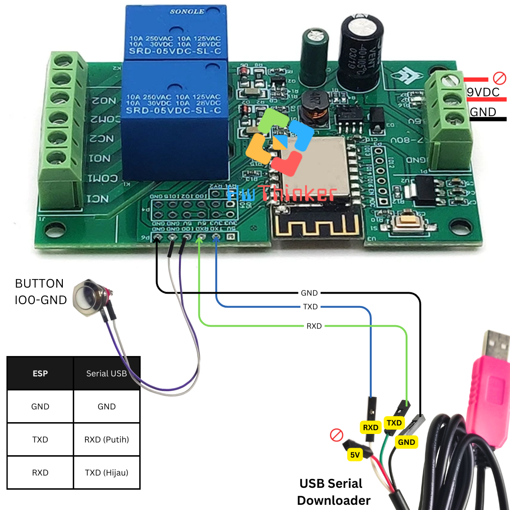

# Modul ESP8266 ESP-12f Relay 2 Channel 


## Cara install plugin Arduino IDE

### Langkah 1: Buka Arduino IDE

1. Buka aplikasi Arduino IDE di komputer Anda. Jika belum ada, unduh dan instal Arduino IDE dari situs resmi Arduino di https://www.arduino.cc/en/software. disarankan menggunakan arduino ide versi 2

### Langkah 2: Tambahkan URL Board Manager untuk ESP8266

2. Di Arduino IDE, buka **File** > **Preferences**.

   

3. Pada bagian  Additional Boards Manager URLs, tambahkan URL berikut:

```
https://arduino.esp8266.com/stable/package_esp8266com_index.json
```

4. Jika sebelumnya Anda sudah memiliki URL lain di sana, pisahkan URL ini dengan tanda koma atau baris baru.


### Langkah 3: Buka Boards Manager

1. Buka **Tools** > **Board** > **Boards Manager**.


2. Di kotak pencarian, ketik **ESP8266**

### Langkah 4: Instal Board ESP8266

1. Temukan **ESP8266 by Espressif Systems** di daftar, kemudian klik **Install**.


2. Tunggu hingga proses instalasi selesai.

### Langkah 5: Pilih Board ESP8266

1. Setelah instalasi selesai, Anda dapat memilih board ESP8266.
2. Buka **Tools** > **Board**, dan gulir ke bawah untuk menemukan berbagai jenis board ESP8266 yang telah diinstal. Pilih board yang sesuai, misalnya **Nodemcu 1.0 (ESP-12E Module)** 


3. hasilnya kurang lebih seperti ini


### Langkah 6: Pilih Port

1. Sambungkan board esp8266 ke komputer Anda menggunakan kabel USB.
2. Di **Tools** > **Port**, pilih port yang sesuai dengan esp8266 Anda.

## Kode Program


## Cara Aktifkan relay
- Hubungkan Jumper RY1 dan RY2 seperti gambar berikut


## Testing Relay

1. **Buat Sketsa Baru**:

   - Buka Arduino IDE, klik **File** → **New** untuk membuat sketsa baru.

2. Ketik Kode 

   ```c++
   #include <Arduino.h>
   
   // Definisikan pin LED
   #define LED_ESP 2
   #define RLY1 4
   #define RLY2 5
   
   
   void setup() {
     // Atur kedua pin sebagai output
     pinMode(LED_ESP, OUTPUT);
     pinMode(RLY1, OUTPUT);
     pinMode(RLY2, OUTPUT);
   }
   
   void loop() {
     // Nyalakan LED pada pin GPIO2 dan matikan LED pada pin GPIO4
     digitalWrite(LED_ESP, HIGH);
     digitalWrite(RLY1, HIGH);
     digitalWrite(RLY2, HIGH);
   
     delay(1000); // Tunggu selama 1 detik
   
     // Matikan LED pada pin GPIO2 dan nyalakan LED pada pin GPIO4
     digitalWrite(LED_ESP, LOW);
     digitalWrite(RLY1, LOW);
     digitalWrite(RLY2, LOW);
     delay(1000); // Tunggu selama 1 detik
   }
   ```

3. **Simpan Sketsa**:

   - Simpan sketsa dengan nama seperti `testing-relay.ino`.

     Cara download dengan jumper


- Pasang serial USB TTL dengan ketentuan: 
   - TX -> RX USB Serial (Kabel Putih)
   - RX -> TX USB Serial (Kabel Hijau)
   - GND -> GND USB Serial (Kabel Hitam)
- Pastikan supply 9VDC dihubungkan pin 7-80VDC
- pasang Jumper untuk menghubungkan IO0 terhubung GND
- Klik tombol reset (Tekan dan lepas tombol reset)
- Download program dan tunggu sampai selesai
- lepas jumper
- Klik tombol reset lagi untuk run-program
- ulang langkah awal bila melakukan download ulang lagi

## Cara download dengan button

- Pasang serial USB TTL dengan ketentuan:
   - TX -> RX USB Serial (Kabel Putih)
   - RX -> TX USB Serial (Kabel Hijau)
   - GND -> GND USB Serial (Kabel Hitam)
- Pastikan supply 9VDC dihubungkan pin 7-80VDC
- pasang push button dengan ujung yang satu ke pin IO0, ujung yang lain ke GND
- Tekan dan tahan push button IO0
- Klik tombol reset (Tekan dan lepas tombol reset) dengan tetap menahan pushbutton IO0
- lepas pushbutton IO0
- Download program dan tunggu sampai selesai
- Klik tombol reset lagi untuk run-program
- ulang langkah awal untuk download ulang

## Cara download dengan Serial USB auto Download

- Pasang serial USB TTL dengan ketentuan:
    - RX -> RX USB Serial  
    - TX -> TX USB Serial 
    - GND -> GND USB Serial  
    - IO0 -> IO# USB Serial 
    - EN -> EN# USB Serial
- Pastikan supply 9VDC dihubungkan pin 7-80VDC
- Download program dan tunggu sampai selesai

> [!NOTE]
> Untuk serial disarankan menggunakan serial auto download
>
> - https://tokopedia.link/Ml3NIixX6Mb atau
> - https://shopee.co.id/product/21375728/27056587756/ 
